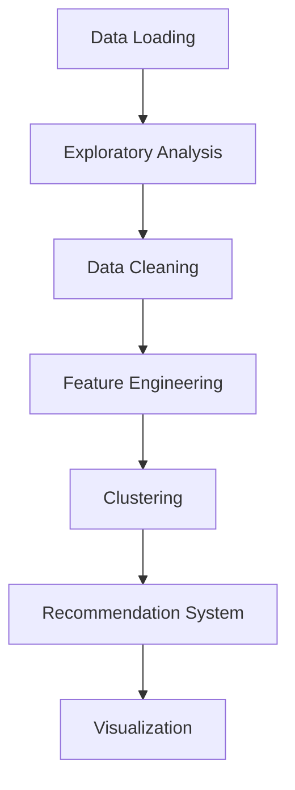

Here's an improved, well-structured README.md file that you can directly copy into your repository:

```markdown
# Customer Segmentation & Product Recommendation System for E-Commerce


## 📌 Table of Contents
- [Project Overview](#-project-overview)
- [Dataset](#-dataset)
- [Workflow](#-workflow)
- [Key Insights](#-key-insights)
- [Cluster Profiles](#-cluster-profiles)
- [Visualizations](#-visualizations)
- [Recommendation System](#-recommendation-system)
- [Installation](#-installation)
- [Usage](#-usage)
- [Future Improvements](#-future-improvements)
- [License](#-license)

## 🌟 Project Overview
This project analyzes e-commerce transaction data to:
1. Segment customers into distinct groups using clustering techniques
2. Generate personalized product recommendations
3. Provide actionable insights for targeted marketing strategies

Built with Python using:
- Pandas for data manipulation
- Scikit-learn for machine learning
- Matplotlib/Seaborn for visualization

## 📂 Dataset
**Source:** [Kaggle E-Commerce Data](https://www.kaggle.com/datasets/)

| Feature | Description |
|---------|-------------|
| `InvoiceNo` | Transaction ID ('C' prefix = cancellations) |
| `StockCode` | Product identifier |
| `Description` | Product name |
| `Quantity` | Units purchased (negative = returns) |
| `InvoiceDate` | Transaction timestamp |
| `UnitPrice` | Price per unit (GBP) |
| `CustomerID` | Unique customer identifier |
| `Country` | Customer location |

**Data Issues Handled:**
- 24.93% missing CustomerIDs
- 0.27% missing Descriptions
- Negative quantities/prices (cancellations)
- Outliers and anomalies

## 🔧 Workflow


## 🔍 Key Insights
### Quantitative Overview
| Metric | Value | Insight |
|--------|-------|---------|
| Avg. Quantity | 9.55 | Extreme range (-80,995 to 80,995) |
| Avg. Unit Price | £4.61 | Outliers up to £38,970 |
| Top Product | "WHITE HANGING HEART T-LIGHT HOLDER" | 2,369 purchases |

### Data Quality


## 👥 Cluster Profiles
### K-Means Segmentation (3 Clusters)

| Cluster | Profile | Key Characteristics |
|---------|---------|----------------------|
| 0 | **Sporadic Shoppers** | Low spend, weekend purchases, stable pattern |
| 1 | **Big Spenders** | High-value transactions, increasing trend |
| 2 | **Frequent Buyers** | High cancellations, unpredictable behavior |


## 📊 Visualizations
1. **Elbow Method for Optimal Clusters**


2. **Silhouette Analysis**


3. **Radar Chart Comparison**


## 🎯 Recommendation System
**How It Works:**
1. Identifies top 10 products per cluster
2. Recommends top 3 unpurchased items per customer
3. Handles outliers separately

